# PFE-NAVIGATOR
## Plateforme Académique de Gestion des Projets de Fin d'Études

> **Système d'information complet pour la gestion, le suivi et la valorisation des PFEs**

---

## 📋 Table des Matières

1. [Vue d'Ensemble](#vue-densemble)
2. [Architecture Technique](#architecture-technique)
3. [Technologies Utilisées](#technologies-utilisées)
4. [Structure du Projet](#structure-du-projet)
5. [Diagrammes UML](#diagrammes-uml)
6. [Flux de Travail Détaillé](#flux-de-travail-détaillé)
7. [API REST Django](#api-rest-django)
8. [Installation & Configuration](#installation--configuration)
9. [Guide de Développement](#guide-de-développement)

---

## Vue d'Ensemble

PFE-Navigator est une plateforme web complète conçue pour moderniser la gestion des Projets de Fin d'Études (PFE) au sein de l'EMSI. Le système automatise le cycle complet de gestion académique :

- **Dépôt et versionnage des rapports** (étudiants)
- **Validation et feedback** (encadrants)
- **Planification des soutenances** (administrateurs)
- **Évaluation par le jury** (jury et encadrants)
- **Valorisation publique** (showcase des meilleurs projets)

---

## Architecture Technique

### Architecture Globale (3-Tier)

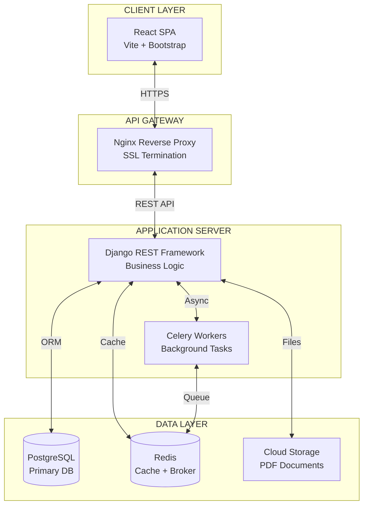

### Architecture des Microservices Internes

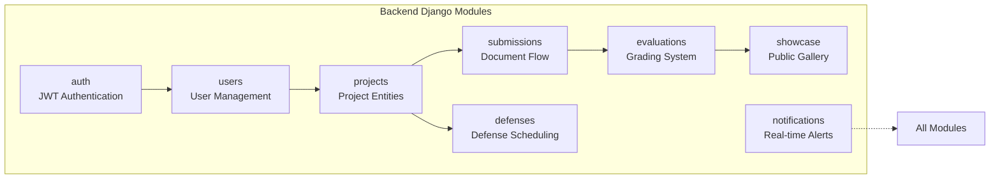

---

## Technologies Utilisées

### Frontend (Client)
| Technologie | Version | Usage |
|-------------|---------|-------|
| React | 19.2.6 | Bibliothèque UI principale |
| Vite | 8.0.10 | Build tool et dev server |
| React Router | 7.14.2 | Routing SPA |
| Bootstrap | 5.3.8 | Framework CSS UI |
| React Bootstrap | 2.10.10 | Composants React Bootstrap |
| Recharts | 3.8.1 | Visualisations graphiques |
| Framer Motion | 12.38.0 | Animations fluides |
| Lucide React | 1.11.0 | Bibliothèque d'icônes |

### Backend (Serveur) - **Django REST + PostgreSQL**

| Technologie | Version | Usage |
|-------------|---------|-------|
| **Python** | 3.11+ | Langage serveur |
| **Django** | 4.2 LTS | Framework web |
| **Django REST Framework** | 3.15+ | API REST |
| **Simple JWT** | 5.3+ | Authentification token |
| **PostgreSQL** | 15+ | Base de données |
| **Redis** | 7+ | Cache & message broker |
| **Celery** | 5.4+ | Tâches asynchrones |
| **Docker** | - | Conteneurisation |

---

## Structure du Projet

```
├── Backend/                    # Django REST API
│   ├── config/                # Settings & WSGI
│   ├── auth/                  # JWT Authentication
│   ├── users/                 # User models & serializers
│   ├── projects/              # Project management
│   ├── submissions/           # Document submission flow
│   ├── defenses/              # Defense scheduling
│   ├── evaluations/           # Grading system
│   ├── showcase/              # Public projects gallery
│   └── notifications/         # Real-time notifications
│
├── Frontend/                  # React SPA
│   ├── src/
│   │   ├── pages/            # Page components by role
│   │   │   ├── Admin/
│   │   │   ├── Jury/
│   │   │   ├── Supervisor/
│   │   │   ├── Student/
│   │   │   └── Common/
│   │   ├── context/          # AppContext state management
│   │   └── assets/
│   └── package.json
│
└── docker-compose.yml          # Multi-container setup
```

---

## Diagrammes UML

### Diagramme de Cas d'Utilisation Complet

```mermaid
graph TD
    STUDENT((Étudiant))
    SUPERVISOR((Encadrant))
    ADMIN((Administrateur))
    JURY((Membre Jury))
    VISITOR((Visiteur))
    
    subgraph "Authentification"
        UC1[Se connecter]
        UC2[Gérer profil]
    end
    
    subgraph "Gestion des Documents"
        UC3[Déposer rapport]
        UC4[Consulter statut]
        UC5[Uploader nouvelle version]
        UC6[Valider rapport]
        UC7[Ajouter commentaires]
    end
    
    subgraph "Planification"
        UC8[Planifier soutenance]
        UC9[Assigner jury]
        UC10[Consulter planning]
    end
    
    subgraph "Évaluation"
        UC11[Noter soutenance]
        UC12[Calculer moyenne]
        UC13[Exporter notes]
    end
    
    subgraph "Showcase"
        UC14[Publier projet]
        UC15[Rechercher projets]
        UC16[Consulter détails]
    end
    
    STUDENT --> UC1
    STUDENT --> UC2
    STUDENT --> UC3
    STUDENT --> UC4
    STUDENT --> UC5
    
    SUPERVISOR --> UC1
    SUPERVISOR --> UC6
    SUPERVISOR --> UC7
    
    ADMIN --> UC1
    ADMIN --> UC8
    ADMIN --> UC9
    
    JURY --> UC1
    JURY --> UC10
    JURY --> UC11
    
    VISITOR --> UC15
    VISITOR --> UC16
```

### Diagramme de Classes (Domain Model)

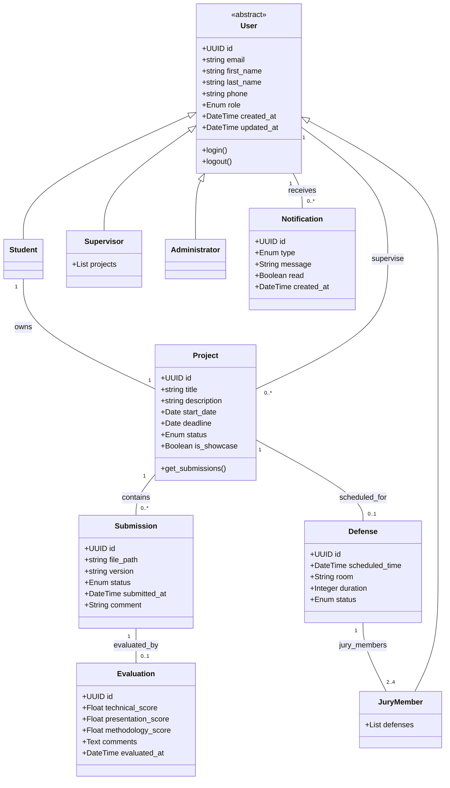

### Diagramme de Séquence : Authentification JWT

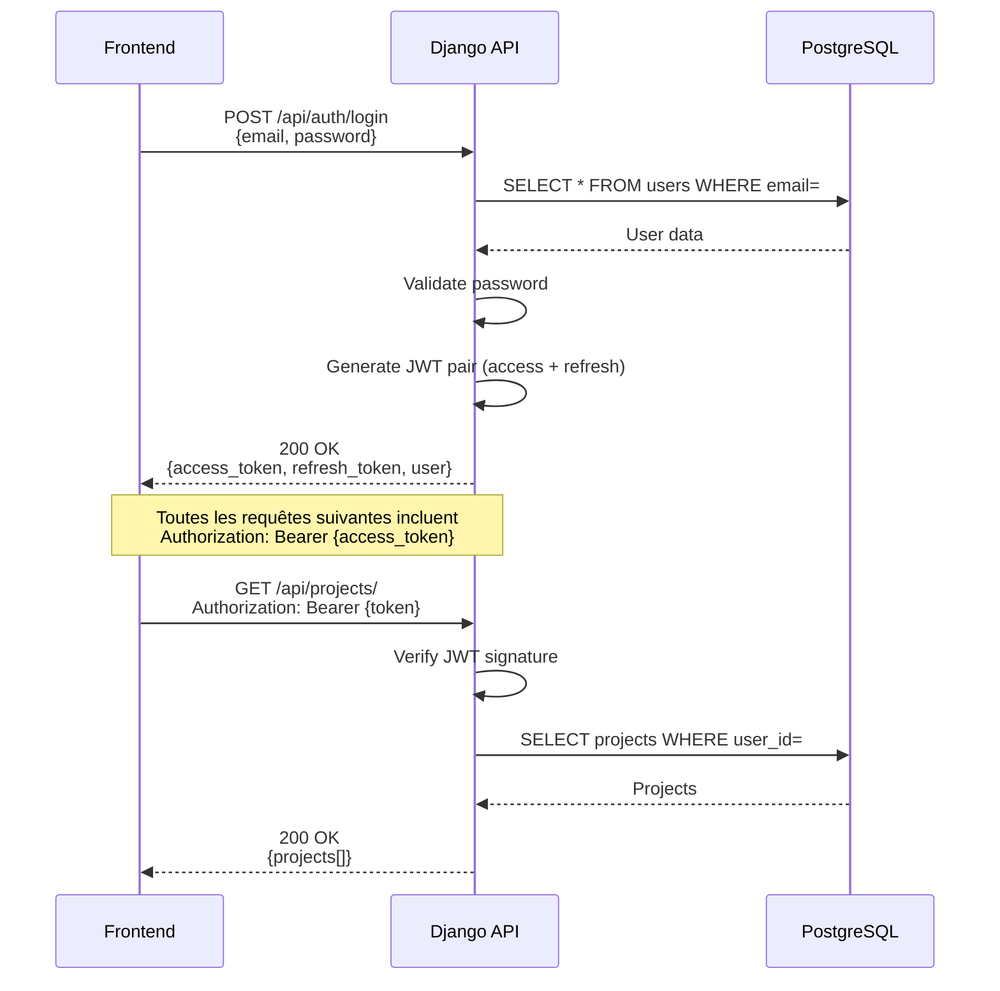

### Diagramme de Séquence : Dépôt et Validation d'un Rapport

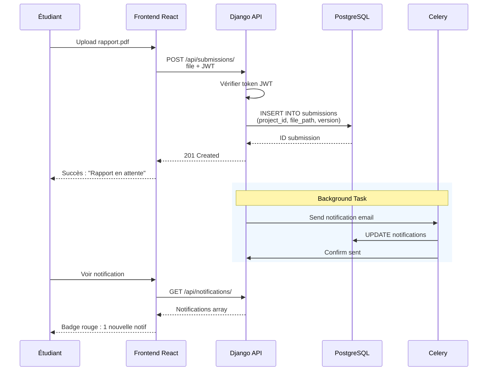

### Diagramme d'Activités : Workflow de Soutenance

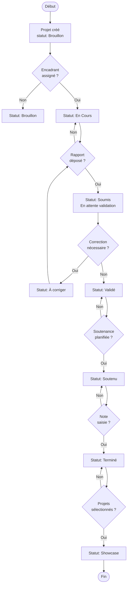

### Diagramme d'États : Machine d'État du Projet

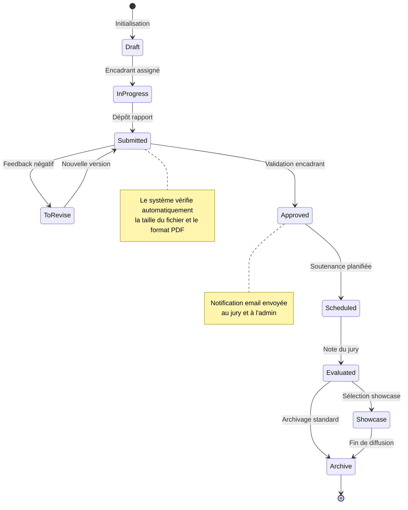

### Diagramme de Déploiement

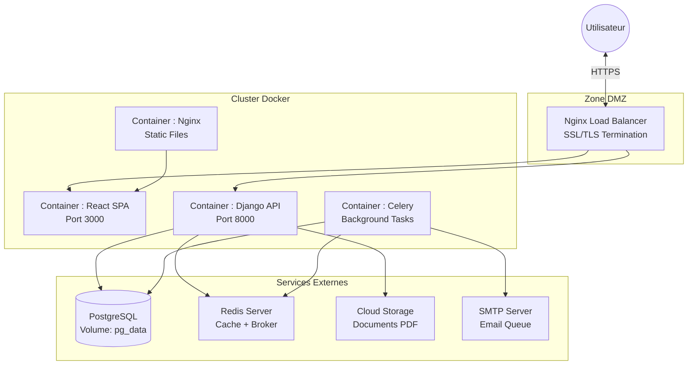

---

## Flux de Travail Détaillé

### 1. Cycle de Vie d'un Projet PFE

#### Phase 1 : Initialisation
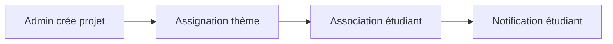

#### Phase 2 : Développement
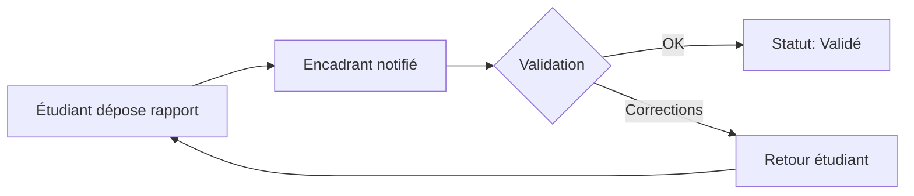

#### Phase 3 : Soutenance
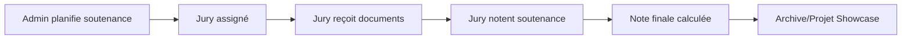

### 2. Architecture des Données PostgreSQL

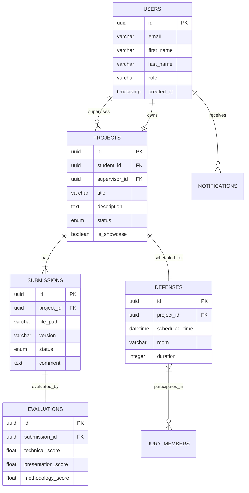

---

## API REST Django

### Endpoints Principaux

| Méthode | Endpoint | Description | Permissions |
|---------|----------|-------------|-------------|
| POST | `/api/auth/login/` | Authentification JWT | Public |
| POST | `/api/auth/refresh/` | Renouveler access token | Public |
| GET | `/api/users/me/` | Profil utilisateur | Authenticated |
| GET | `/api/projects/` | Liste des projets | Authenticated |
| POST | `/api/projects/` | Créer projet | Admin |
| GET | `/api/submissions/` | Liste des dépôts | Authenticated |
| POST | `/api/submissions/` | Déposer rapport | Student |
| PATCH | `/api/submissions/{id}/` | Valider/Commenter | Supervisor |
| GET | `/api/defenses/` | Planning soutenances | Authenticated |
| POST | `/api/defenses/` | Planifier soutenance | Admin |
| POST | `/api/evaluations/` | Saisir notes | Jury |
| GET | `/api/showcase/` | Projets publiés | Public |

### Exemple de Réponse API

```json
{
  "id": "550e8400-e29b-41d4-a716-446655440000",
  "title": "Système de recommandation intelligent",
  "description": "Plateforme d'IA pour la recommandation...",
  "student": {
    "id": "123e4567-e89b-12d3-a456-426614174000",
    "name": "Youssef LAGMOUCH",
    "email": "youssef.lagmouch@emsi.ma"
  },
  "supervisor": {
    "id": "123e4567-e89b-12d3-a456-426614174001",
    "name": "Dr. Saad BOUFERRA"
  },
  "status": "validated",
  "created_at": "2026-01-15T10:30:00Z",
  "is_showcase": true
}
```

---

## Installation & Configuration

### Prérequis
- Python 3.11+
- Node.js 18+
- PostgreSQL 15+
- Redis 7+
- Docker & Docker Compose (recommandé)

### Installation Backend (Django)

```bash
cd Backend
python -m venv venv
source venv/bin/activate  # Windows: venv\Scripts\activate
pip install -r requirements.txt
python manage.py migrate
python manage.py createsuperuser
python manage.py runserver
```

### Installation Frontend (React)

```bash
cd Frontend
npm install
npm run dev
```

### Docker Compose (Production)

```bash
docker-compose up -d
# Services démarrés:
# - frontend: http://localhost:3000
# - backend: http://localhost:8000
# - postgres: localhost:5432
# - redis: localhost:6379
```

---

## Guide de Développement

### Structure des Apps Django

```
Backend/
├── config/
│   ├── settings/
│   │   ├── base.py      # Settings communs
│   │   ├── dev.py       # Development
│   │   └── prod.py      # Production
│   └── urls.py
│
├── users/
│   ├── models.py        # User, Profile
│   ├── serializers.py   # DRF Serializers
│   ├── views.py         # API Views
│   └── permissions.py   # RBAC Custom
│
├── projects/
│   ├── models.py        # Project model
│   └── api/             # ViewSets & Routers
│
└── requirements/
    ├── base.txt
    ├── dev.txt
    └── prod.txt
```

### Exemple de Modèle Django

```python
# users/models.py
from django.contrib.auth.models import AbstractUser
from django.db import models

class User(AbstractUser):
    ROLE_CHOICES = [
        ('student', 'Student'),
        ('supervisor', 'Supervisor'),
        ('jury', 'Jury Member'),
        ('admin', 'Administrator'),
    ]
    
    role = models.CharField(max_length=20, choices=ROLE_CHOICES)
    phone = models.CharField(max_length=20, blank=True)
    
    class Meta:
        db_table = 'users'
```

---

## 📞 Contact & Support

- **Développeurs** : Youssef LAGMOUCH & Saad BOUFERRA
- **Encadrant** : M. MOURCHID
- **Institution** : École Marocaine des Sciences de l'Ingénieur (EMSI)

---

*Documentation générée pour le projet PFE-Navigator - Année Universitaire 2025-2026*